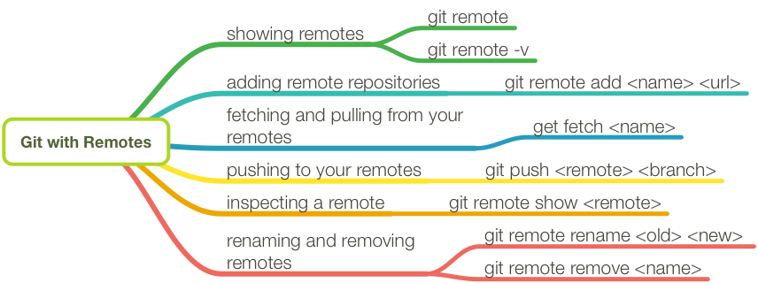

# 如何参与贡献开源项目？

以杨保华先生的开源书籍《区块链技术指南》为例。

首先，在 GitHub 上 fork 到自己的仓库，如 `docker_user/blockchain_guide`，然后 clone 到本地，并设置用户信息。

```shell
$ git clone git@github.com:docker_user/blockchain_guide.git
$ cd blockchain_guide
$ git config user.name "yourname"
$ git config user.email "your email"
```

更新内容后提交，并推送到自己的仓库。

```shell
# do some change on the content
$ git commit -am "Fix issue #1: change helo to hello"
$ git push
```

最后，在 GitHub 网站上提交 pull request 即可。

另外，建议定期使用项目仓库内容更新自己仓库内容。

```shell
$ git remote add upstream https://github.com/yeasy/blockchain_guide
$ git fetch upstream
$ git checkout master
$ git rebase upstream/master
$ git push -f origin master
```

## 相关命令图解



## References

- [参与贡献 - 区块链技术指南](https://yeasy.gitbooks.io/blockchain_guide/content/contribute.html) - 杨保华
- [Git - Working with Remotes](https://git-scm.com/book/en/v2/Git-Basics-Working-with-Remotes) - git-scm.com